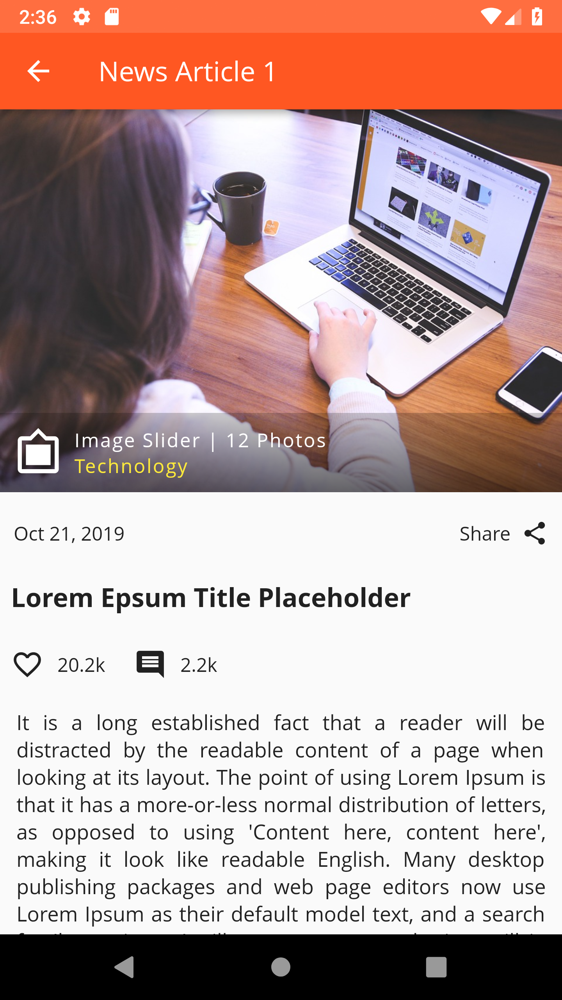
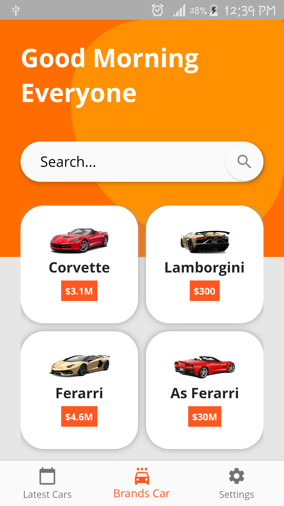

# Flutter UIs

### Login UI
 

### Profile UI
 

### List UI

### Article UI

### AboutUs UI

### Miscellanenousre
    

### Inspirations
https://www.uplabs.com/posts/login-ui-d7273650-e473-476f-9a04-1ace8d9f1f4b
